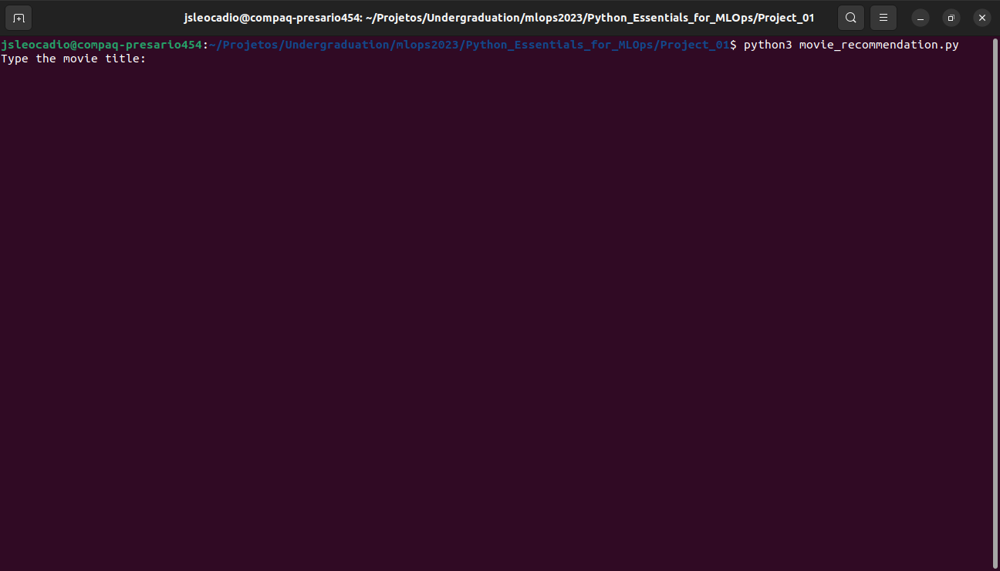

# Movie Recommendation System

## Introduction

This project is a Movie Recommendation System built in Python and was adapted to have the best practices. 

## How to Run it

1. Download the data

With the following commands we can download the dataset needed to run our code:
```
wget -q https://files.grouplens.org/datasets/movielens/ml-25m.zip
unzip ml-25m.zip
```

2. Installing dependencies:

In our `requirements.txt` are our dependencies in this project, to install all, using this comand:
```
pip install -r requirement.txt
```

3. Executing the code:

Executing this code input the title and see the results:

```
python3 movie_recommendation.py
```

After this, the code will ask the movie title like this:




And after typing the title, the code will generate the response:


## Linting the code

Using `pylint` we verified our code to have a passing grade.

```
pylint movie_recommendation.py
```

This is ou result:


## Testing our code

Using `pytest` we created a `test.py` to verified the response of our code.

Testing our code:

```
pytest tests.py
```


## References

* [Dataquest's Portifolio](https://app.dataquest.io/m/99994)
* [Dataquest's GitHub Repository](https://github.com/dataquestio/project-walkthroughs/tree/master/movie_recs)